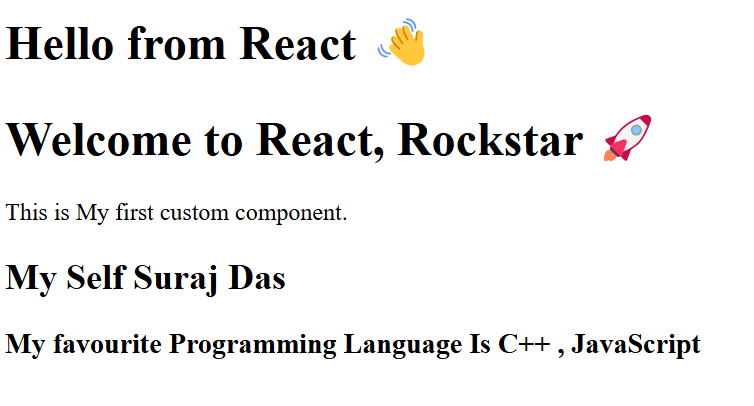

# 🚀 Day 1: Welcome React Setup

📅 **Date:** 2025-04-06  
📁 **Folder:** `Day-1/Welcome_React`

---

### ✅ What I Did

- Initialized a React app using **Vite**
- Setup local dev environment (`npm install`, `npm run dev`)
- Created basic folder structure
- Tested if React is running successfully

---

### 📂 Folder Structure

```
Welcome_React/
├── index.html
├── package.json
├── vite.config.js
└── src/
    ├── App.jsx
    ├── main.jsx
    └── assets/
```

---

### 🧠 Learnings

- Difference between CRA and Vite
- Understanding the role of `main.jsx` and `App.jsx`
- How to run a React project locally

---

### 📸 Screenshot



---

### 📝 Notes

This marks the beginning of my React journey — excited for what's next!
